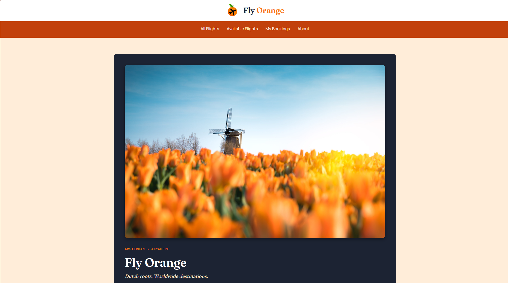
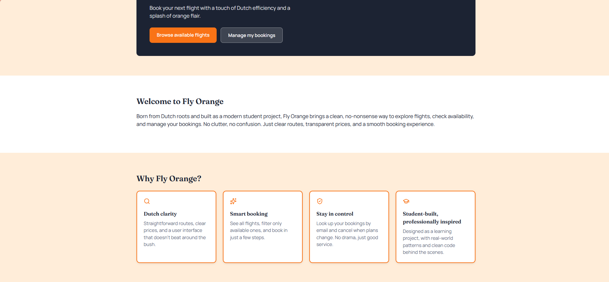
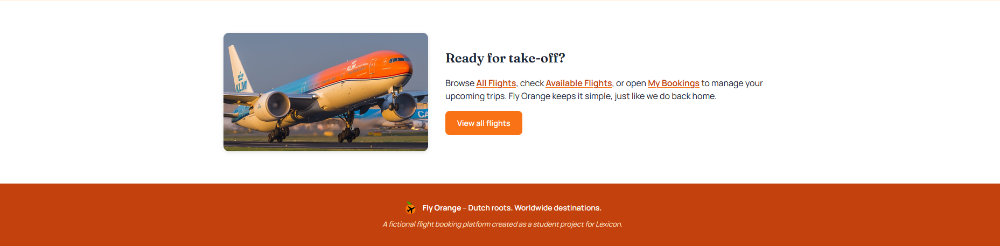
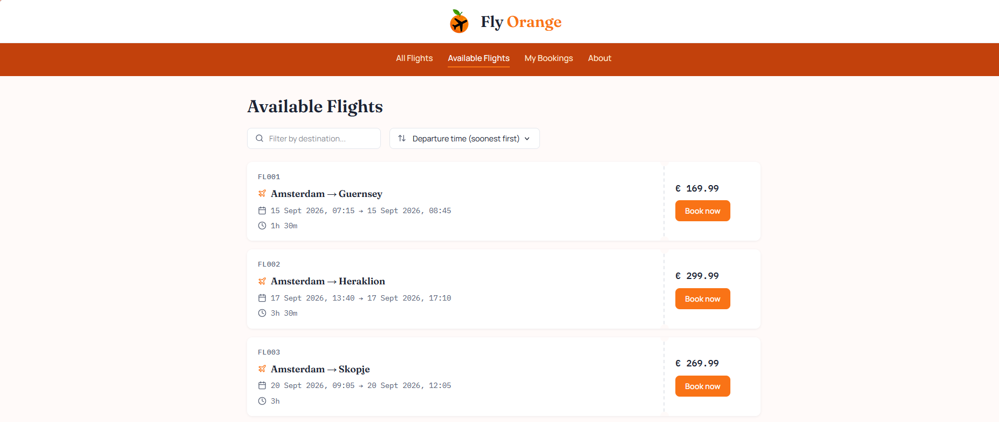
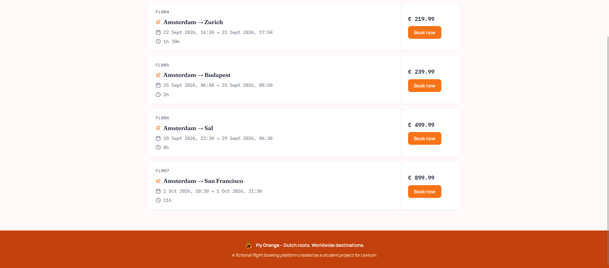

# ✈️ Fly Orange – Flight Booking Interface

This repository contains my **Project Test 3** assignment, built for *Lexicon's fullstack Java developer course*.
The goal of the assignment was to build a working flight search and booking interface on top of a provided
**Spring Boot REST API**, using **React, TypeScript, React Router and lucide-react**.

The backend (entity, DTOs, controller, service, repository) was provided by Lexicon. Along the way I found and fixed
several bugs in it, including a race condition risk in the booking flow and a case-sensitive email comparison bug 
and extended it with an `origin` field so every flight has both a departure and an arrival city, not just a
destination.

👉 [View project instructions](ProjectInstructions.md)

---

## 📚 Table of Contents

- [Project Goals](#-project-goals)
- [Features](#-features)
- [Components](#-components)
- [Pages](#-pages)
- [About Page](#-about-page)
- [Technologies Used](#-technologies-used)
- [Project Structure](#-project-structure)
- [Running Locally](#-running-locally)
- [Screenshots](#-screenshots)

---

## 🎯 Project Goals

- Build a React frontend from scratch with **Vite + TypeScript**
- Consume a provided **Spring Boot REST API** for all flight and booking data
- Practice **state management**, **derived data** (filtering/sorting), and **controlled forms**
- Keep the **project structure clean and easy to follow**
- Use **lucide-react** icons instead of hand-written SVGs
- Go beyond the required features by adding both optional features (booking lookup, cancellation), plus my own
  extras (filtering, sorting, a custom design system, an About page)

---

## 🌟 Features

**Required**
- ✔ View **all flights**, with filtering by destination and status, and sorting by price or departure time
- ✔ View only **available flights**
- ✔ **Book a flight**, with passenger name and email, validated both client-side and server-side

**Optional (both included)**
- ✔ **Look up bookings by email**
- ✔ **Cancel a booking**, with a confirm-before-cancel step

**Extras I added on top**
- ✔ A designed **homepage** with a hero section, feature highlights, and a call-to-action, even though it
  wasn't required by the assignment
- ✔ Custom **orange design system**: boarding-pass-styled flight cards, a dark hero panel, a monogram-style header
- ✔ **Filtering and sorting** on both flight list pages
- ✔ Dismissible **toast notifications** for booking confirmations and cancellations, instead of static banners
- ✔ A dedicated **About page** explaining the reasoning behind the destinations and design choices
- ✔ A custom **404 page** and per-page browser tab titles
- ✔ Fully responsive layout, including a stacked flight card layout on small screens

---

## 🧩 Components

### Layout components

| Component | Purpose |
|---|---|
| `Navbar` | White logo strip + orange navigation bar, shown on every page. Highlights the active route. |
| `Footer` | Site footer with logo, tagline and a short disclaimer. Logo links back to the homepage. |
| `ScrollToTop` | Scrolls the window to the top on every route change, since React Router doesn't do this by default. |

### Flight components

| Component | Purpose |
|---|---|
| `FlightCard` | Displays a single flight: number, route, times, duration, status badge, and price. Supports an optional booking action (as a separate button or a clickable status badge, depending on the page) and an optional context (so a `BOOKED` status reads as positive on My Bookings, and negative elsewhere). |
| `FlightFilterBar` | Reusable destination filter, status filter (optional) and sort dropdown, shared by the All Flights and Available Flights pages. |
| `BookingModal` | Native `<dialog>`-based modal for booking a flight, with client-side validation mirroring the backend's rules. |
| `Toast` | Bottom-right, auto-dismissing (or manually closable) notification, used for booking and cancellation confirmations. |

---

## 🔀 Pages

| Page | Route | Contains |
|---|---|---|
| `HomePage` | `/` | Hero section, intro, feature grid, and a call-to-action section |
| `AllFlightsPage` | `/flights` | Every flight, with destination/status filters and sorting |
| `AvailableFlightsPage` | `/flights/available` | Only bookable flights, with destination filtering and sorting |
| `MyBookingsPage` | `/my-bookings` | Email lookup, cancellation with confirmation, shown alongside a full-height photo |
| `AboutPage` | `/about` | The reasoning behind the destinations, branding and tech choices |
| `NotFoundPage` | `*` | Custom 404 page for any unmatched route |

`Navbar`, `Footer` and `ScrollToTop` are rendered in `App.tsx` **outside** of `<Routes>`, so they stay consistent
across every page instead of being duplicated inside each page component.

---

## 🖼️ About Page

The About page explains three things a reviewer wouldn't otherwise know from just looking at the code:

- **Why these destinations** — all ten are places I've actually traveled to, and I deliberately kept the list at
  the original ten rather than adding more
- **Design decisions** — why "Fly Orange" over a more literal Dutch name, and why the flight cards are styled like
  boarding passes
- **Built with** — the tech stack, and what I extended beyond the provided backend

---

## 🛠️ Technologies Used

**Frontend**
- **React 18**
- **TypeScript**
- **Vite**
- **react-router-dom**
- **lucide-react** (icons)

**Backend** (provided by Lexicon, extended and fixed by me)
- **Spring Boot**
- **Spring Data JPA**
- **MySQL**
- **springdoc-openapi** (Swagger UI)

---

## 📁 Project Structure

```
frontend/
├── src/
│ ├── api/ → flightApi.ts (all backend requests, error handling)
│ ├── components/ → FlightCard, FlightFilterBar, BookingModal, Toast, Navbar, Footer, ScrollToTop
│ ├── hooks/ → usePageTitle.ts
│ ├── pages/ → HomePage, AllFlightsPage, AvailableFlightsPage, MyBookingsPage, AboutPage, NotFoundPage
│ ├── types/ → flight.ts
│ └── App.tsx
backend/
└── src/main/java/se/lexicon/flightbooking_api/
├── config/ → FlightBookingDataRunner, CorsConfig, SwaggerConfig
├── controller/ → FlightBookingController
├── dto/ → FlightListDTO, AvailableFlightDTO, FlightBookingDTO, BookFlightRequestDTO
├── entity/ → FlightBooking, FlightStatus
├── exception/ → MyExceptionHandler and custom exceptions
├── mapper/ → FlightBookingMapper
├── repository/ → FlightBookingRepository
└── service/ → FlightBookingService, FlightBookingServiceImpl
```
---

## ▶️ Running Locally

### Backend

1. Start a MySQL container:
```bash
   docker run --name flight-booking-mysql -e MYSQL_ROOT_PASSWORD=root -p 3306:3306 -d mysql:8.0
```
2. Run `FlightBookingApiApplication` from IntelliJ (or `./mvnw spring-boot:run`)
3. The API runs on `http://localhost:8080`, with Swagger docs at `/swagger-ui.html`

### Frontend

1. `cd frontend`
2. `npm install`
3. Create a `.env` file in `frontend/` with:
```
   VITE_API_BASE_URL=http://localhost:8080
```
4. `npm run dev`
5. Open `http://localhost:5173`

---

## 📸 Screenshots

### Homepage




### Available Flights




---

Thanks for checking out my project 🧡✈️
